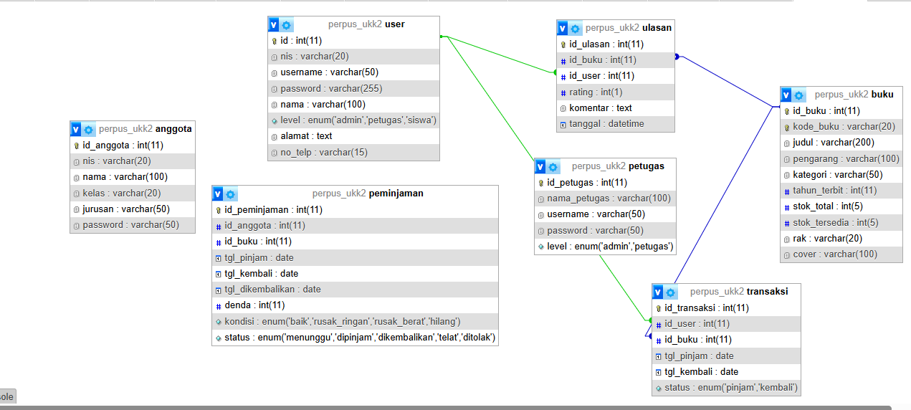
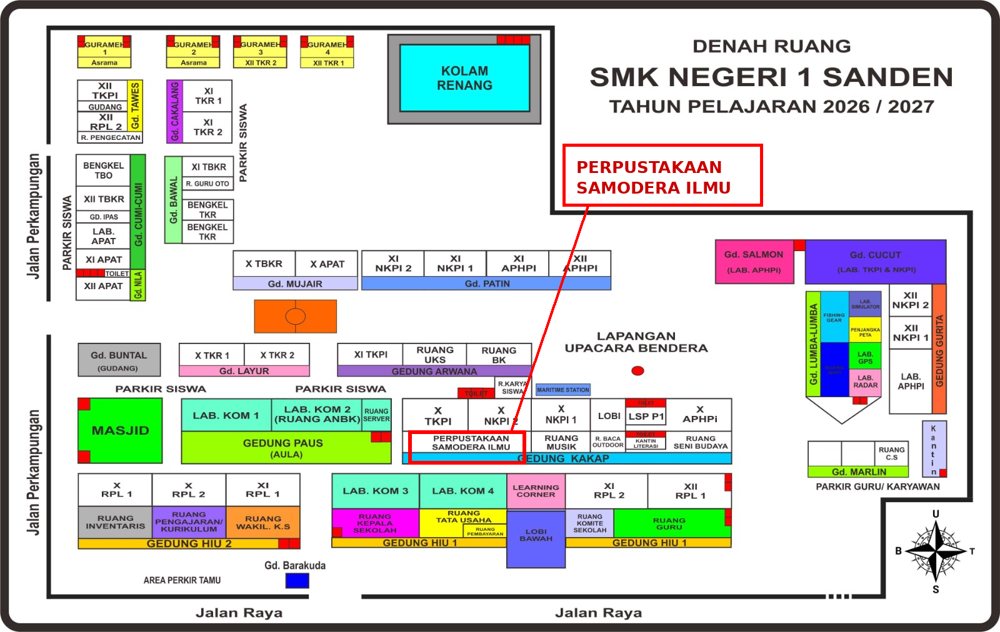
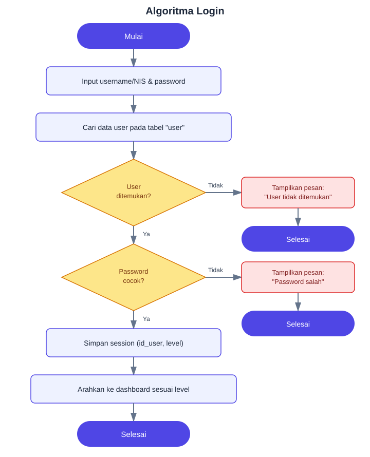
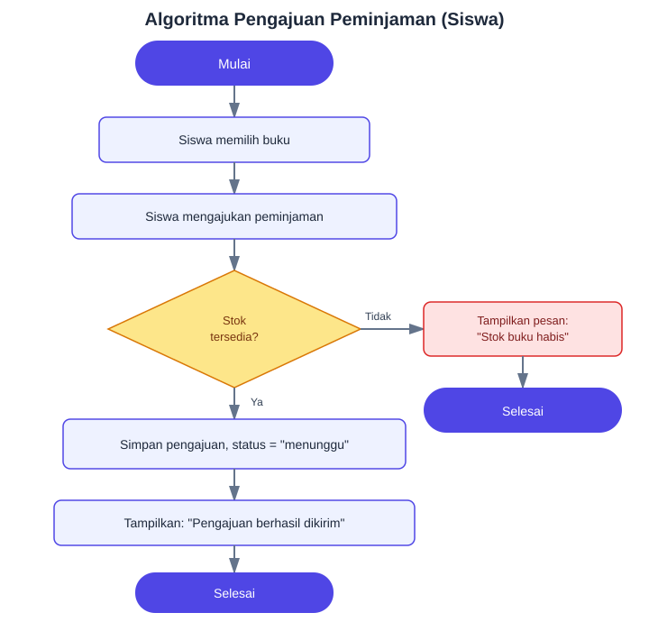
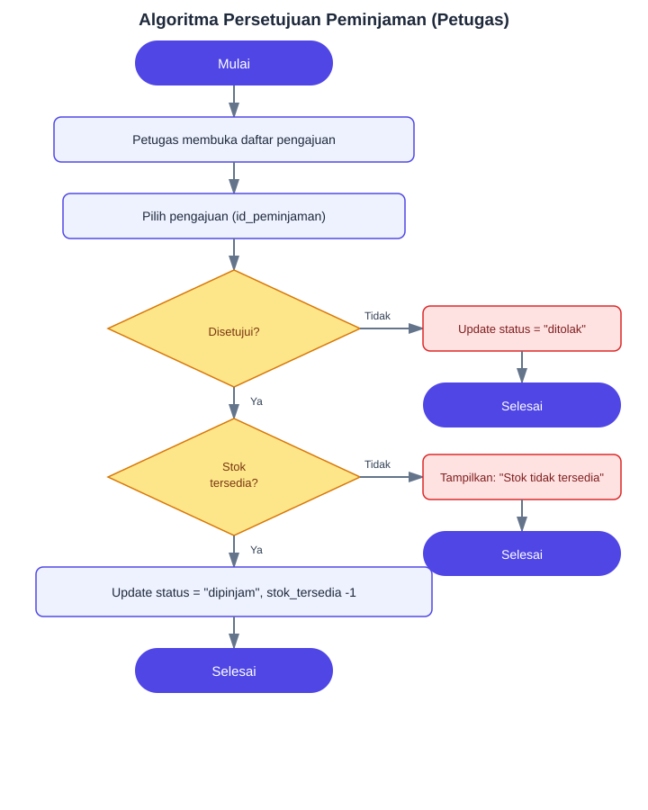
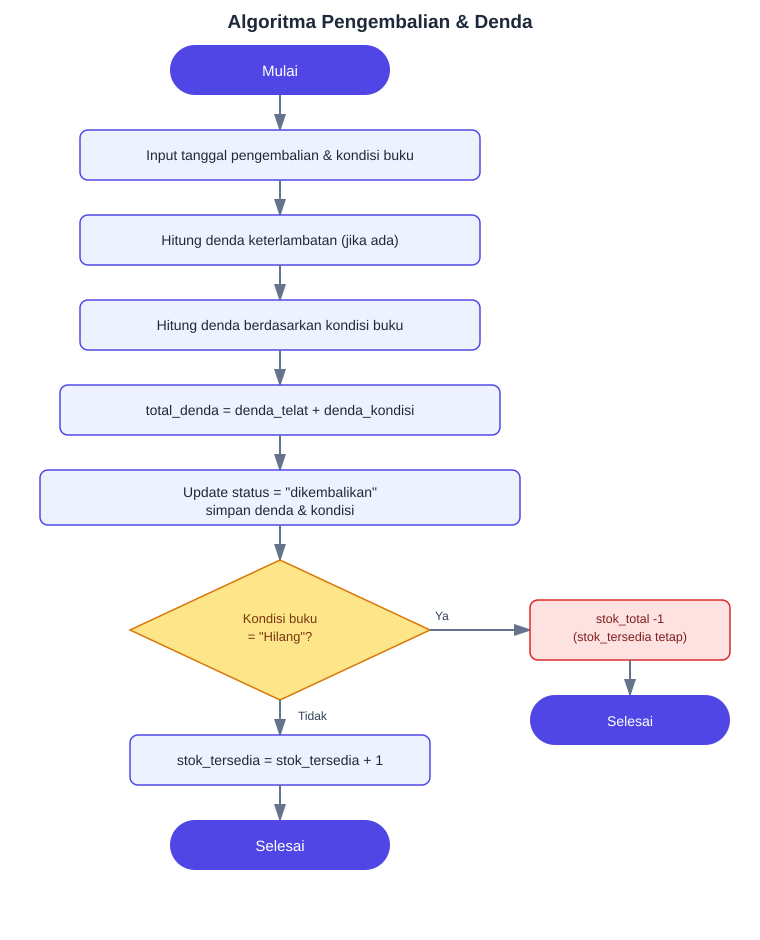
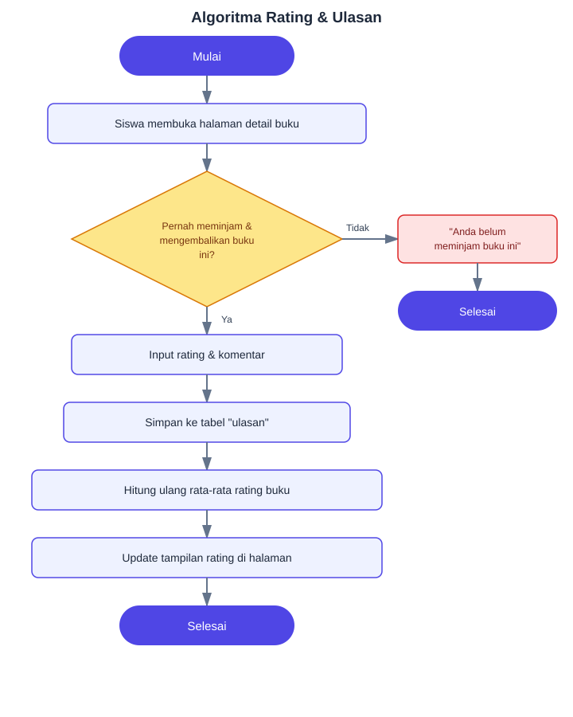

📚 UKK Perpustakaan SMK N 1 Sanden

Sistem Informasi Perpustakaan Digital yang dibuat untuk UKK (Uji Kompetensi Keahlian) RPL SMK N 1 Sanden.

Aplikasi ini membantu pengelolaan katalog buku, data siswa, data petugas, peminjaman, persetujuan peminjaman, pengembalian, rating, ulasan, notifikasi, dan laporan perpustakaan.

## 🌐 Demo & Repository

- Repository: [github.com/Ayu155/perpusukk2](https://github.com/Ayu155/perpusukk2)
- Demo (frontend statis): [ayu155.github.io/perpusukk2](https://ayu155.github.io/perpusukk2)
- Live Demo (full backend PHP + MySQL): [perpusukk2.free.nf](https://perpusukk2.free.nf)
- Panel Hosting (InfinityFree): [dash.infinityfree.com/accounts/if0_42754193](https://dash.infinityfree.com/accounts/if0_42754193)
- Mockup / Desain UI (Google Stitch): [stitch.withgoogle.com/projects/17320341967523360622](https://stitch.withgoogle.com/projects/17320341967523360622?pli=1)

> ⚠️ Catatan: link panel hosting InfinityFree di atas mengarah ke halaman kontrol akun (butuh login). Sebaiknya di README publik cukup cantumkan link demo live-nya saja (perpusukk2.free.nf); link dashboard akun biasanya tidak perlu dipublikasikan karena berkaitan langsung dengan pengelolaan akun hosting.

Catatan: Source aplikasi pada repository menggunakan PHP dan MySQL sehingga untuk menjalankan fungsi backend secara penuh diperlukan server PHP + MySQL. URL demo statis (GitHub Pages) dapat digunakan sebagai halaman/demo frontend saja, sedangkan live demo di InfinityFree menjalankan backend PHP + MySQL secara penuh.

## ✨ Fitur

### 👨‍💼 Admin

Admin memiliki akses untuk mengelola data utama sistem perpustakaan.

- Dashboard statistik perpustakaan
- Mengelola data buku (tambah, edit, hapus)
- Mengelola data siswa (tambah, edit, hapus)
- Mengelola data petugas
- Melihat laporan peminjaman
- Melihat notifikasi pengajuan peminjaman
- Melihat statistik buku dan peminjaman
- Melihat buku populer
- Melihat data keterlambatan
- Melihat stok buku yang menipis
- Melihat statistik kategori buku
- Melihat rating dan kualitas buku

### 👨‍🏫 Petugas

Petugas bertanggung jawab terhadap pengelolaan buku dan proses peminjaman/pengembalian.

- Dashboard petugas
- Melihat, menambah, mengedit, menghapus data buku
- Melihat data siswa
- Mengelola persetujuan peminjaman (setuju/tolak)
- Memproses pengembalian buku
- Menghitung denda keterlambatan
- Mencatat kondisi buku saat pengembalian
- Melihat riwayat peminjaman

### 👨‍🎓 Siswa

Siswa dapat menggunakan sistem untuk mencari dan meminjam buku.

- Registrasi anggota
- Login menggunakan username atau NIS
- Dashboard siswa
- Melihat koleksi buku, mencari dan memilih buku
- Mengajukan peminjaman & membatalkan pengajuan yang masih menunggu
- Melihat buku yang sedang dipinjam & yang akan jatuh tempo
- Melihat riwayat peminjaman
- Memberikan rating buku & ulasan/komentar
- Mengelola profil (ubah username, ubah password)

## 🔐 Hak Akses

| Role | Dashboard | Buku | Siswa | Petugas | Peminjaman | Pengembalian | Laporan | Rating & Ulasan |
|------|-----------|------|-------|---------|------------|--------------|---------|------------------|
| Admin | ✅ | ✅ | ✅ | ✅ | 👁️ | 👁️ | ✅ | 👁️ |
| Petugas | ✅ | ✅ | ✅ | ❌ | ✅ | ✅ | ❌ | 👁️ |
| Siswa | ✅ | 👁️ | 👤 | ❌ | ✅ | 👁️ | ❌ | ✅ |

Keterangan: ✅ = memiliki akses/pengelolaan · 👁️ = dapat melihat data · 👤 = mengelola profil sendiri · ❌ = tidak tersedia

## 🔄 Flowchart Alur Peminjaman


Alur singkat:

1. Siswa login lalu melihat koleksi buku dan mengajukan peminjaman → status **MENUNGGU**.
2. Petugas mengecek pengajuan: **SETUJUI** atau **TOLAK**.
   - Jika ditolak → status **DITOLAK**.
   - Jika disetujui → sistem mengecek stok buku.
3. Jika stok tersedia → status **DIPINJAM**, `stok_tersedia` dikurangi 1.
4. Siswa mengembalikan buku → sistem mengecek keterlambatan dan kondisi buku, lalu menghitung denda.
5. Status berubah menjadi **DIKEMBALIKAN**, `stok_tersedia` ditambah 1 (kecuali kondisi buku "Hilang").
6. Siswa dapat memberikan rating & ulasan buku.

## 🗄️ ERD (Entity Relationship Diagram)



> Catatan: nama file gambar ERD diasumsikan `ed.png` sesuai yang sudah diunggah di repository. Sesuaikan nama file pada tag gambar di atas jika nama filenya berbeda.

Relasi utama antar tabel:

- **user** (1) — (1) **anggota**: setiap akun siswa pada tabel `user` memiliki satu data anggota di tabel `anggota`.
- **user** (1) — (N) **ulasan**: satu user dapat memberikan banyak ulasan/rating.
- **anggota** (1) — (N) **peminjaman**: satu anggota dapat melakukan banyak transaksi peminjaman.
- **buku** (1) — (N) **peminjaman**: satu buku dapat dipinjam berkali-kali (di waktu berbeda).
- **buku** (1) — (N) **ulasan**: satu buku dapat menerima banyak ulasan/rating dari siswa berbeda.
- **petugas** berdiri sendiri (mengelola proses persetujuan & pengembalian, tidak berelasi langsung sebagai foreign key ke tabel lain berdasarkan query yang digunakan).

## 🎨 Mockup / Lokasi Perpustakaan

Perpustakaan **Samodera Ilmu** berada di **Gedung Kakap**, SMK N 1 Sanden — berikut lokasinya pada denah ruang sekolah:



Detail lokasi (diperbesar):


Selain denah lokasi fisik di atas, rancangan tampilan (mockup UI) aplikasi juga dibuat menggunakan **Google Stitch** sebelum diimplementasikan ke kode:

🔗 [Lihat mockup UI di Google Stitch](https://stitch.withgoogle.com/projects/17320341967523360622?pli=1)

Mockup UI mencakup rancangan halaman:

- Landing page (termasuk grafik, rating bintang, dan kualitas buku)
- Halaman login
- Dashboard admin, petugas, dan siswa
- Halaman data buku, peminjaman, dan laporan

## 🗄️ Struktur Database

Aplikasi terhubung ke database MySQL dengan nama database: `perpus_ukk2`

Berdasarkan query yang digunakan oleh source code, tabel utama yang digunakan adalah:

**user** — menyimpan akun dan data pengguna sistem.
```
user
├── id
├── id_user
├── nis
├── username
├── password
├── nama
├── level      (admin / petugas / siswa)
├── alamat
└── no_telp
```

**anggota** — digunakan dalam proses peminjaman sebagai data anggota/siswa.
```
anggota
├── id_anggota
└── id_user
```

**petugas** — menyimpan data petugas perpustakaan.
```
petugas
├── id_petugas
├── username
├── password
├── nama_petugas
└── level
```

**buku** — menyimpan katalog dan stok buku.
```
buku
├── id_buku
├── kode_buku
├── judul
├── pengarang
├── kategori
├── tahun_terbit
├── cover
├── stok_total
├── stok_tersedia
└── rak
```

**peminjaman** — menyimpan seluruh proses peminjaman dan pengembalian.
```
peminjaman
├── id_peminjaman
├── id_anggota
├── id_buku
├── tgl_pinjam
├── tgl_kembali
├── tgl_dikembalikan
├── status     (menunggu / dipinjam / ditolak / dikembalikan)
├── denda
└── kondisi
```

**ulasan** — menyimpan rating dan komentar siswa terhadap buku.
```
ulasan
├── id_ulasan
├── id_buku
├── id_user
├── rating
└── komentar
```

> Struktur kolom di atas ditulis berdasarkan kolom yang dipanggil oleh source code. Repository ini tidak menyertakan dump SQL sehingga definisi lengkap tipe data/constraint database perlu disesuaikan dengan database yang digunakan saat deployment.

## ⚙️ Algoritma

Berikut algoritma (pseudocode) dari proses-proses utama pada aplikasi.

### 1. Algoritma Login



```
INPUT: username_atau_nis, password
1. Ambil data user dari tabel `user` berdasarkan username atau nis
2. IF data ditemukan THEN
     IF password cocok THEN
        Simpan session (id_user, level)
        Arahkan ke dashboard sesuai level:
          admin   -> admin/dashboard.php
          petugas -> petugas/dashboard.php
          siswa   -> siswa/dashboard.php
     ELSE
        Tampilkan pesan "Password salah"
   ELSE
     Tampilkan pesan "User tidak ditemukan"
```

### 2. Algoritma Pengajuan Peminjaman (Siswa)



```
INPUT: id_anggota, id_buku
1. Pastikan siswa sudah login
2. Ambil data buku berdasarkan id_buku
3. IF stok_tersedia > 0 THEN
     Simpan pengajuan baru ke tabel peminjaman dengan status = "menunggu"
     Tampilkan pesan "Pengajuan berhasil dikirim"
   ELSE
     Tampilkan pesan "Stok buku habis"
```

### 3. Algoritma Persetujuan Peminjaman (Petugas)



```
INPUT: id_peminjaman, keputusan (setuju / tolak)
1. Ambil data peminjaman berdasarkan id_peminjaman
2. IF keputusan == "setuju" THEN
     IF stok_tersedia > 0 THEN
        Update status = "dipinjam"
        stok_tersedia = stok_tersedia - 1
     ELSE
        Tampilkan pesan "Stok tidak tersedia"
   ELSE
     Update status = "ditolak"
3. Simpan perubahan ke database
```

### 4. Algoritma Pengembalian & Perhitungan Denda



```
INPUT: id_peminjaman, kondisi_buku, tgl_dikembalikan
1. Ambil data peminjaman berdasarkan id_peminjaman
2. selisih_hari = tgl_dikembalikan - tgl_kembali
3. IF selisih_hari > 0 THEN
     denda_telat = selisih_hari * tarif_denda_per_hari
   ELSE
     denda_telat = 0
4. SWITCH kondisi_buku:
     "Baik"         -> denda_kondisi = 0
     "Rusak Ringan" -> denda_kondisi = 5000
     "Rusak Berat"  -> denda_kondisi = 20000
     "Hilang"       -> denda_kondisi = 50000, stok_total = stok_total - 1
5. total_denda = denda_telat + denda_kondisi
6. Update peminjaman: status = "dikembalikan", denda = total_denda, kondisi = kondisi_buku
7. IF kondisi_buku != "Hilang" THEN stok_tersedia = stok_tersedia + 1
8. Simpan perubahan ke database
```

### 5. Algoritma Rating & Ulasan



```
INPUT: id_buku, id_user, rating, komentar
1. Cek apakah siswa (id_user) pernah meminjam & mengembalikan buku (id_buku) tersebut
2. IF ya THEN
     Simpan rating dan komentar ke tabel ulasan
   ELSE
     Tampilkan pesan "Anda belum meminjam buku ini"
3. Hitung ulang rata-rata rating buku (AVG rating dari semua ulasan pada id_buku)
4. Update tampilan rating pada landing page dan halaman detail buku
```

## 🔗 Relasi Data

```
                 ┌──────────────┐
                 │     USER     │
                 └──────┬───────┘
                        │
             ┌──────────┴──────────┐
             │                     │
             ▼                     ▼
       ┌───────────┐          ┌───────────┐
       │  ANGGOTA  │          │  ULASAN   │
       └─────┬─────┘          └─────┬─────┘
             │                      │
             │                      │
             ▼                      ▼
       ┌──────────────┐       ┌───────────┐
       │ PEMINJAMAN   │──────►│   BUKU    │
       └──────────────┘       └───────────┘

                 ┌──────────────┐
                 │   PETUGAS    │
                 └──────────────┘
```

## 📁 Struktur Folder

```
perpusukk2/
│
├── admin/
│   ├── dashboard.php
│   ├── data_buku.php
│   ├── data_petugas.php
│   ├── data_siswa.php
│   ├── edit_buku.php
│   ├── edit_siswa.php
│   ├── hapus_buku.php
│   ├── hapus_siswa.php
│   ├── laporan.php
│   ├── notifikasi.php
│   ├── tambah_buku.php
│   └── tambah_siswa.php
│
├── petugas/
│   ├── dashboard.php
│   ├── data_buku.php
│   ├── data_siswa.php
│   ├── pengembalian.php
│   └── persetujuan.php
│
├── siswa/
│   ├── dashboard.php
│   └── profil.php
│
├── assets/
│   └── cover/
│       └── (cover buku, dst.)
│
├── gambar/
│   ├── logo_rpl.png
│   ├── logo_sekolah.png
│   └── (cover buku, dst.)
│
├── video/
│   └── vidd.mp4
│
├── cek_login.php
├── daftar.php
├── index.php
├── koneksi.php
├── login.php
└── logout.php
```

## 🛠️ Teknologi

| Teknologi | Penggunaan |
|-----------|------------|
| PHP | Backend dan server-side processing |
| MySQL | Penyimpanan data |
| HTML5 | Struktur halaman |
| CSS3 | Tampilan antarmuka |
| JavaScript | Interaksi halaman |
| Bootstrap 5.3.3 | Komponen dan layout responsif |
| Google Fonts | Tipografi antarmuka |
| Google Stitch | Mockup / desain UI aplikasi |
| XAMPP | Local development |
| InfinityFree | Hosting live demo |
| Git & GitHub | Version control dan repository |

## 🚀 Cara Menjalankan di Localhost

**1. Clone Repository**
```
git clone https://github.com/Ayu155/perpusukk2.git
cd perpusukk2
```

**2. Pindahkan ke XAMPP**

Letakkan folder project ke: `C:\xampp\htdocs\perpusukk2`

**3. Jalankan XAMPP**

Aktifkan **Apache** dan **MySQL**.

**4. Buat Database**

Buka `http://localhost/phpmyadmin`, buat database `perpus_ukk2`, lalu buat/import tabel sesuai struktur database yang digunakan oleh aplikasi.

> Penting: file source yang tersedia tidak menyertakan file dump `.sql`, sehingga database harus dibuat dari struktur database yang digunakan pada server/local environment.

**5. Konfigurasi Koneksi**

File koneksi berada di `koneksi.php`:

```php
$koneksi = mysqli_connect(
    "localhost",
    "root",
    "",
    "perpus_ukk2"
);
```

Sesuaikan username, password, dan nama database apabila konfigurasi MySQL Anda berbeda.

**6. Jalankan Aplikasi**

Buka `http://localhost/perpusukk2/`

## 🔑 Sistem Login

Login menggunakan satu sistem autentikasi dengan pilihan level pengguna.

```
                  LOGIN
                    │
          ┌─────────┼─────────┐
          ▼         ▼         ▼
        ADMIN     PETUGAS    SISWA
          │         │         │
          ▼         ▼         ▼
       Admin/     Petugas/   Siswa/
       dashboard  dashboard  dashboard
```

Siswa dapat login menggunakan **Username** atau **NIS**. Sistem menentukan halaman tujuan berdasarkan level akun:

```
admin   → admin/dashboard.php
petugas → petugas/dashboard.php
siswa   → siswa/dashboard.php
```

## 📊 Dashboard

**Dashboard admin** menyediakan informasi seperti: jumlah buku, jumlah siswa, jumlah petugas, jumlah peminjaman aktif, pengajuan yang menunggu, peminjaman terbaru, buku populer, buku yang terlambat dikembalikan, stok buku yang menipis, statistik kategori buku, statistik peminjaman berdasarkan periode, dan rating/kualitas buku.

**Dashboard petugas** menyediakan informasi operasional seperti: jumlah buku, jumlah peminjaman aktif, jumlah siswa, dan jumlah pengajuan yang menunggu.

**Dashboard siswa** menyediakan informasi personal seperti: buku yang sedang dipinjam, pengajuan yang menunggu, riwayat peminjaman, buku yang mendekati jatuh tempo, buku populer, serta rating dan ulasan.

## 📖 Pengelolaan Buku

Data buku memiliki informasi: Kode Buku, Judul, Pengarang, Kategori, Tahun Terbit, Cover, Stok Total, Stok Tersedia, Rak.

Admin dan petugas dapat melakukan pengelolaan data buku sesuai hak akses masing-masing.

## 🔄 Pengembalian & Denda

Saat buku dikembalikan, sistem dapat mencatat: tanggal pengembalian, kondisi buku, denda keterlambatan, status pengembalian, dan perubahan stok buku.

Riwayat peminjaman kemudian dapat ditampilkan kembali pada halaman persetujuan/riwayat dan laporan.

## ⭐ Rating & Ulasan

Setelah peminjaman selesai, siswa dapat memberikan:

- ⭐ Rating buku
- 💬 Komentar/ulasan

Data rating digunakan pada halaman utama dan dashboard untuk menampilkan kualitas serta popularitas buku.

## 📸 Screenshot

Tambahkan screenshot aplikasi pada folder:

```
docs/
└── screenshots/
    ├── landing-page.png
    ├── login.png
    ├── dashboard-admin.png
    ├── dashboard-petugas.png
    ├── dashboard-siswa.png
    ├── data-buku.png
    ├── peminjaman.png
    └── laporan.png
```

Kemudian tampilkan di README dengan format:

```markdown


```

## 📌 Status Project

Status: 🟢 Completed / Portfolio Project

Project ini dikembangkan sebagai tugas UKK RPL SMK N 1 Sanden dengan fokus pada pembuatan sistem perpustakaan digital yang memiliki beberapa level pengguna dan alur peminjaman buku.

## 👩‍💻 Developer

- **Ayu Rahmawati**
- 🎓 Siswa RPL
- 🏫 SMK N 1 Sanden
- 📅 Tahun: 2026
- 👩‍🏫 Pembimbing: Salsa Bella Putri, S.Kom.
- ⏱️ Durasi pengerjaan: ± 3 bulan

## 🏷️ Tags

`PHP` `MySQL` `Perpustakaan` `Sistem Informasi` `UKK` `RPL` `SMK` `Library Management System` `Web Application` `Bootstrap`

## 📄 Lisensi

Project ini dibuat untuk keperluan pembelajaran, UKK, dan portfolio.

© 2026 Ayu Rahmawati
